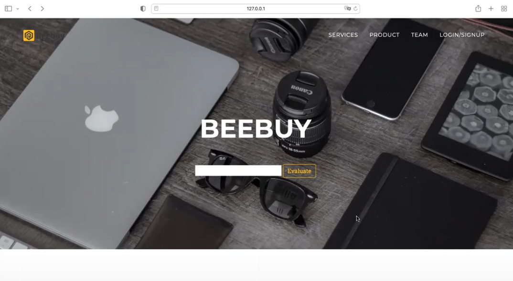
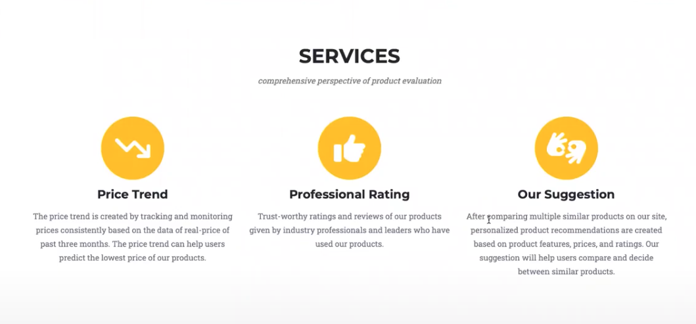
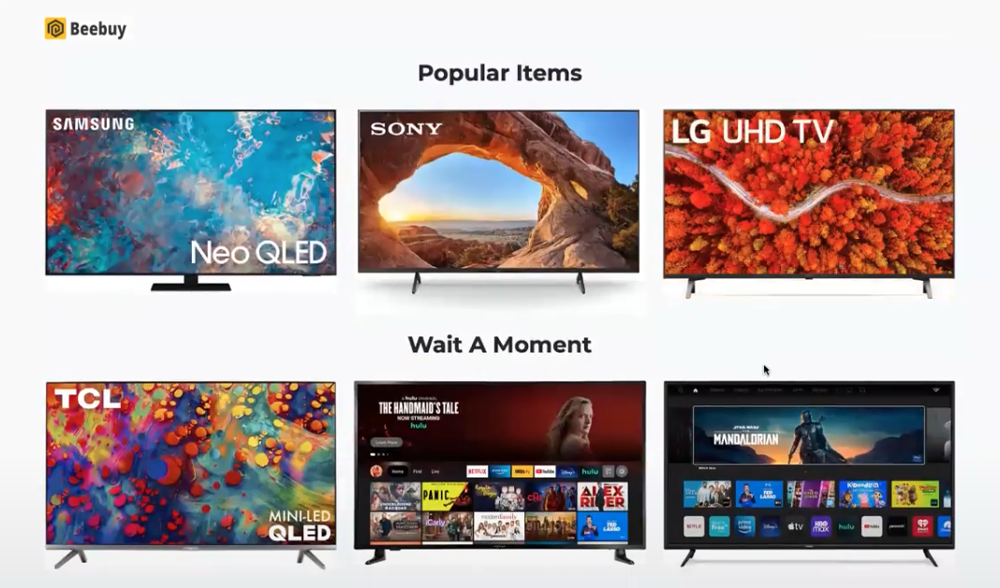
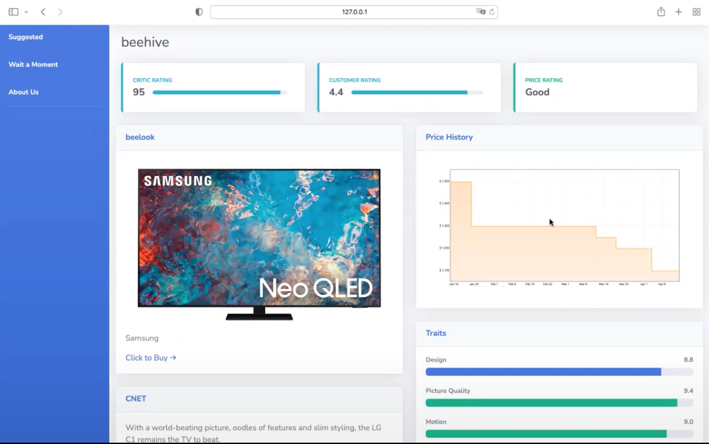
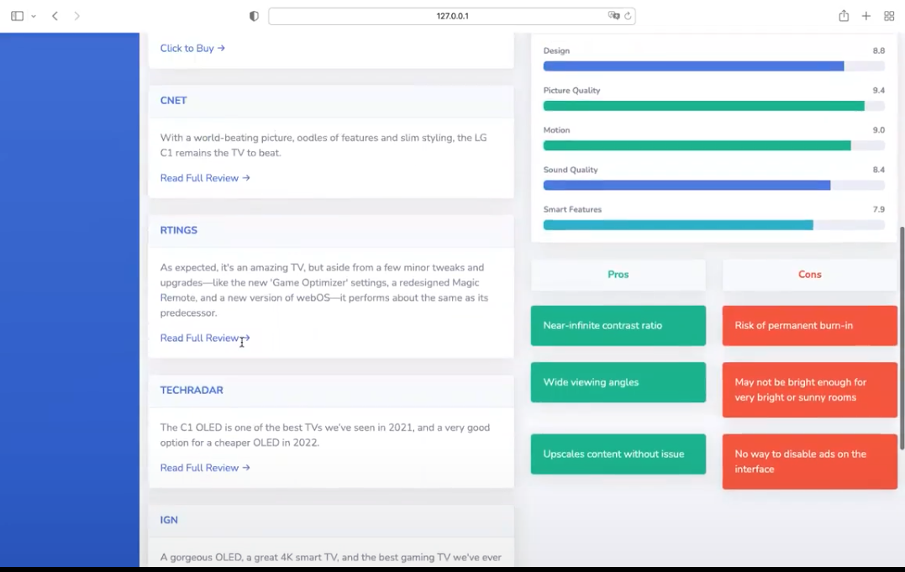

# BeeBuy 🐝

BeeBuy is a website that helps users to make better purchase decisions and prevent impulse purchases by providing summaries of products that users are interested in buying. 
This could include reasons like inflated pricing or poor reviews from other customers. Providing pricing trends for a user’s desired product would give them a better idea about when to make the purchase decision. Often times, the prices are seasonal in nature and a large discount could be offered by the manufacturer could be potentially offered. So holding off a big purchase could save a customer significant money. Additionally, the reviews of many products are scattered across multiple websites. We intent to apply NLP technologies summarize multiple reviews and highlight negative issues to customers so that they are aware of it.

## Motivation 💫

We understand that everyone has at least experienced one of the following situations before:

1. You found something in the back of your closet that you purchased months ago, which you have only used once.
2. You purchased something and soon found out the price dropped for more than a half.
3. You purchased something and after a while you regretted that you did not choose another similar product instead.
4. You purchased something and after that you realized to use it you actually needed to invest on a number of associated stuff that could cost even more than the product itself.
5. You were browsing shopping websites, and you just simply did not have anyone next to you to discuss what to get.

## What BeeBuy can help with? 💡

1. We present a graph the price history of the provided item, ideally even from multiple website.
2. We process reviews of other customers and make a summary out of all the reviews.
3. We present a list of similar or related products for the user to compare and consider.
## Website 🖥  
### Main Page

### Product Page

### Meet our members:
| Position | Name |
| --- | --- |
| CEO | [David Lyu](https://github.com/MuhuanLyu) |
| CTO | [Yoli Wu](https://github.com/hereisyoli) |
| COO | [Young Zeng](https://github.com/youngzyx) |
| Product Manager | [Chandan Nayak](https://github.com/nayakchandan) |
| Software Engineer | [Yunhe Jia](https://github.com/YunheJ) |
| Data Scientist | [Meilin Li](https://github.com/meilin-l99) |
| Data Engineer | [Jaysen Shi](https://github.com/jaysenshi) |
